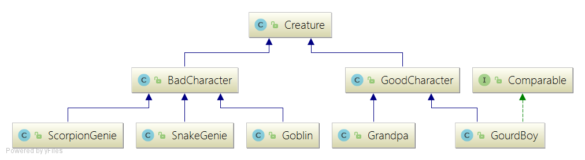
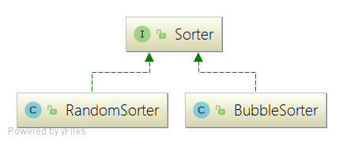
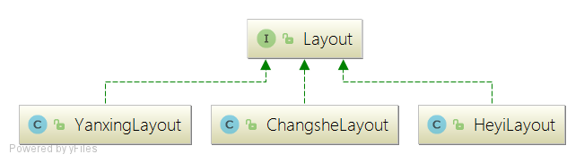

# 葫芦兄弟
## 抽象层次设计
### 角色
将角色抽象成GoodCharacter和BadCharacter两种，这两种角色再向上抽象成Creature。  
Creature类有共同的方法如下：
 
	void report();  //报告自己身份
	void setQueuePosition(Position queuePosition); //设置队形中的相对位置
	Position getQueuePosition(); //报出自己在队形中的相对位置
	void setPosition(Position position); //设置自己的绝对位置

### 排序器
由于对一队生物的排列本质上都是在生物的排列顺序进行调整，所以将排序作为一个接口，可以对一队生物使用各种方式进行排序。  

	public void sort(Queue queue);
  
Sorter类用于对Queue中的Creature进行排序，RandomSorter用于打乱顺序，BubbleSorter用冒泡排序从小到大排序。  

### 布阵器
由于布阵本质上是对一队生物阵型中的相对位置进行调整，所以将布阵也作为一个接口，使用不同的布阵器对各种Queue进行布阵。

	public void place(Queue queue);

Layout类用于设置阵型中生物的相对位置，使得Queue中生物按照某一阵型进行排列。

## 设计原则
### OCP开放封闭原则
Sorter和Layout的设计都依照了这一原则。Queue中生物排列顺序以及阵型独立于Queue，如果需要新的排列方式或者阵型，只需新增一个Sorter或者Layout的子类型即可，而无需修改原有系统。
### LSP LISKOV替换法则
在Creature和Queue的设计中依照了这一原则。Queue中存放Creature的数组，而非某一具体角色，这样使得Queue更具有通用性；由于角色均从Creature派生而来，因此在处理时也是直接对Creature进行处理。
### DIP依赖倒置原则
在Creature，Sorter，Layout的设计中，子类型都是通过基类提供的接口进行实现。