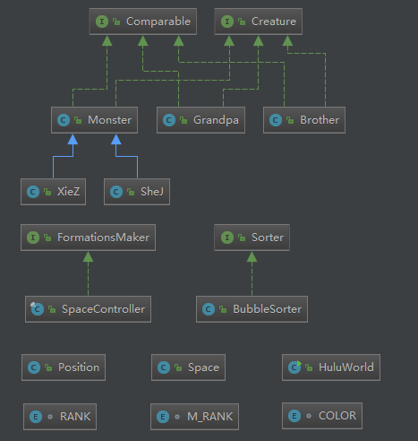

## 10.10作业：面向葫芦娃编程

### 作业思路

>###1.代码结构

>

>###2.设计思路 

>结合课上老师的编程思想指导，在类的构建上沿用老师的代码，并进行必要的修改，最终思路如下： 
 
>#### a.主要登场人物的抽象   

>出场人物类均继承自接口 Creature 和 Comparable；  

>怪物类实例默认为喽啰，而蛇精和蝎子精是继承自怪物类的特殊怪物，提供单例模式；  

>爷爷也仅提供单例模式。

>#### b.战场抽象  

>Position类 为一个二维坐标位置的抽象；

>Space类 为二维战场的抽象，仅有对二维战场的基础操作。 

>#### c.排序与队形抽象

>将排序和队形抽象为接口:Sorter 和 FormationsMaker;

>自定义排序类BubbleSorter类 和 SpaceController类 分别具体实现接口中的方法，以实现排序和队形功能。

>#### d.流程抽象（主函数）

>HuluWorld类中运行主函数，实现作业所需流程。

### 概念、机制和设计理念

>### 1.封装、继承和多态

>通过对作业描述的情况抽象，运用继承使得各类的关系更接近于实际情况。 

>对类数据的相关操作仅仅提供接口函数，使用者调用时不必知道具体实现过程，只需要提供必要参数。因此类内部的结构可以自由修改，且便于隐藏数据信息。

>作业中主要通过接口实现多态，通过复写接口的方法实现不同的生物类实例执行如*report()*方法后，会打印不同的信息。具有灵活性和可扩充性。

>### 2.单例模式  

>为更加接近实际情况，蛇精、蝎子精和爷爷实现时均为饿汉式单例模式。便于对具体实例的控制，具有灵活性

>### 3.SOLID设计原则

>SRP保证一个类中导致类变化的理由只有一个，便于组织代码，降低耦合。  

>ISP保证了不会出现“胖”接口，例如Space类中只有对空间的基础操作，将排序、排阵型这些功能实现委托给接口，通过继承接口并对其方法复写实现对应功能，同时其他人也能通过这些接口实现自己的算法。能降低耦合，代码结构更清晰。

>OCP原则。所有类属性均设置为私有，仅对外提供必要的接口以获取或修改数据。保证代码的灵活性、可重用性、可维护性。

