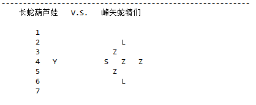
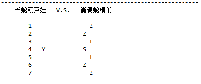
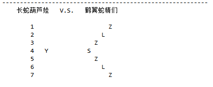

## 面向葫芦娃编程

### 生物类的抽象，重写
> 在葫芦娃的世界中，存在各种各样的生物：葫芦娃，老爷爷，蛇精，蝎子精...... 为了对他们进行统一管理和处理（比如打印输出），我们抽象出了一个生物(Creature)类，所有的各种具体的生物都继承自这个类，并且在继承的类中分别重写了一些Creature中的接口(比如getSymb, getName)。 
> 
> 这样做的好处就是：1）方便各种生物的统一处理；2）可扩展性更好，未来添加其他生物很简单；

### 二维平面的抽象：点 -> 位置 -> 平面
> 各种生物都处于一个二维平面中，为了进行统一管理，我们首先定义一个点(Point)，即具有一个二维坐标(x, y)的物理位置的抽象表示；然后，由于每个位置上都可以有一个生物，于是我们又在点的基础上定义一个位置(Position)，它有一个点和一个生物组成; 接下来，一个二维空间又可以由点的二维矩阵来表示，于是就得到了平面(Plane)类。
>
> 每个类都有属于自己范围的方法。对于Point类，它有两个坐标分量的getter和setter方法；对于Position类，它有point和creature的getter和setter方法；对于Plane类，有打印所有点，清空所有点，添加生物，添加阵型的方法。

### 运行结果

