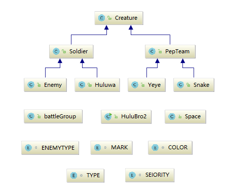

# 葫芦娃版本2代码说明
## 代码结构


## 概念与机制
在实现过程中用到了继承，封装，多态面向对象的三大特性

### 继承  
如上图所示
+ 爷爷和蛇精继承了拉拉队
+ 葫芦兄弟和敌人继承了战士
+ 拉拉队和战士继承了生物
由于battleGroup是Soldier的集合，Space是独立的空间，HuluBro2是运行的主程序，因此没有继承关系。  
另外，由于在本次代码中没有地方需要用到重写，因此没有使用到重写的功能。

### 封装
以battleGroup为例:
```
public class battleGroup{
    public battleGroup(TYPE Type,int Size);
    public battleGroup(TYPE Type,int Size,int[] Ran);
    public boolean ChangShe(int row,int col);
    public boolean ChongE(int row,int col);

    Soldier []group;
    int size;
    TYPE type;
}
```
将与战斗群体相关的构造函数以及排阵方法隐藏，用户只需直接调用函数即可。并且对不同的语句加上特定的访问修饰符限制访问权限。  
另外，葫芦娃或者敌人对象作为战斗群体的成员，在构造战斗群体的时候需要用到，满足has-a条件，因此用到了类间关系中的组合。

### 多态
如上所示，构造函数`battleGroup`由于参数的不同可以初始化不同队伍，为使用该类的人提供多种初始化方式，且上述的`Soldier []group`数组用来指向不同的对象——葫芦娃和敌人对象，便于程序的调整。

## 设计理念
+ 把复杂的程序分解成一个个对象，利用对象间的关系，相互调用，来实现功能。
+ 将具有相似属性和功能的对象设计为一个类，并且不断细化类的功能
+ 尽可能的使用枚举类型，便于变量的管理。  
+ 其中_Creature_没有作为接口或者抽象类的原因是：他的子类都满足is-a条件，且Creature的成员与方法都十分清晰，并可直接使用到所有的子类中，不需要重写或者重载。